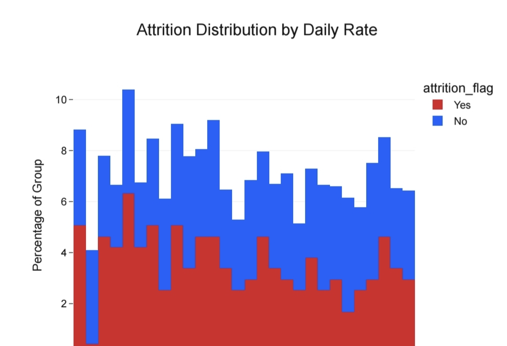

# IBM HR Analytics – Employee Attrition Analysis & Prediction

## Project Overview

This project analyzes employee attrition using the IBM HR Analytics dataset. The objective is to identify the key factors affecting employee turnover and build a machine learning model that predicts whether an employee is likely to leave the organization.

---

## Business Problem

Employee attrition increases recruitment costs, reduces productivity, and affects business continuity. HR teams need a data-driven approach to identify employees who are at high risk of leaving and take preventive actions.

---

## Business Objective

- Analyze employee data
- Identify factors affecting attrition
- Perform exploratory data analysis
- Build a machine learning prediction model
- Generate business recommendations

---

## Dataset Information

Dataset Name: IBM HR Analytics Employee Attrition & Performance

Source: Kaggle

Records: 1470

Features: 35

Target Variable: Attrition

# Technologies Used

- Python
- Pandas
- NumPy
- Scikit-learn
- Matplotlib
- Seaborn
- Plotly
- Jupyter Notebook

# Project Workflow

1. Data Collection
2. Data Cleaning
3. Exploratory Data Analysis (EDA)
4. Feature Engineering
5. Data Visualization
6. Machine Learning Model Building
7. Model Evaluation
8. Business Insights
9. Business Recommendations

# Project Features

- Data Cleaning and Preprocessing
- Exploratory Data Analysis
- Interactive Visualizations
- Feature Engineering
- Employee Attrition Prediction
- Feature Importance Analysis
- Model Evaluation
- Business Recommendations

# Skills Demonstrated

- Data Cleaning
- Data Analysis
- Data Visualization
- Feature Engineering
- Machine Learning
- Classification
- Business Analytics
- HR Analytics
| Item | Details |
|------|---------|
| Dataset | IBM HR Analytics Employee Attrition |
| Rows | 1470 |
| Columns | 35 |
| Target Variable | Attrition |
| Source | Kaggle |

# Key Insights

- Employees working overtime are more likely to leave the organization.
- Monthly income has a significant impact on employee retention.
- Employees with lower job satisfaction show higher attrition.
- Younger employees tend to have a higher attrition rate.
- Certain departments and job roles experience higher employee turnover.
- Feature importance analysis identifies the most influential variables affecting attrition.

# Business Recommendations

- Reduce excessive overtime to improve employee well-being.
- Improve employee engagement and job satisfaction.
- Review compensation strategies for employees with lower salaries.
- Develop targeted retention programs for high-risk employees.
- Provide career development and training opportunities.
- Continuously monitor employee attrition using predictive analytics.

# Machine Learning

The project includes machine learning techniques to predict employee attrition.

Model Used:

- Random Forest Classifier

Model Evaluation:

- Confusion Matrix
- ROC Curve
- Classification Metrics
- Feature Importance

# Repository Structure

IBM-HR-Analytics-Employee-Attrition-Prediction
│
├── data
├── images
├── notebooks
├── reports
├── outputs
├── README.md
├── requirements.txt
├── LICENSE

# How to Run

1. Clone this repository.

2. Install the required libraries.

pip install -r requirements.txt

3. Open the notebook.

4. Run all cells sequentially.

# Future Improvements

- Improve prediction accuracy
- Deploy using Streamlit
- Build an interactive Power BI dashboard
- Perform hyperparameter tuning
- Experiment with advanced machine learning models---

# License

This project is licensed under the MIT License.
## Hr kpi Dashboard

## Attrition Distribution

## Corelation Heatmap

